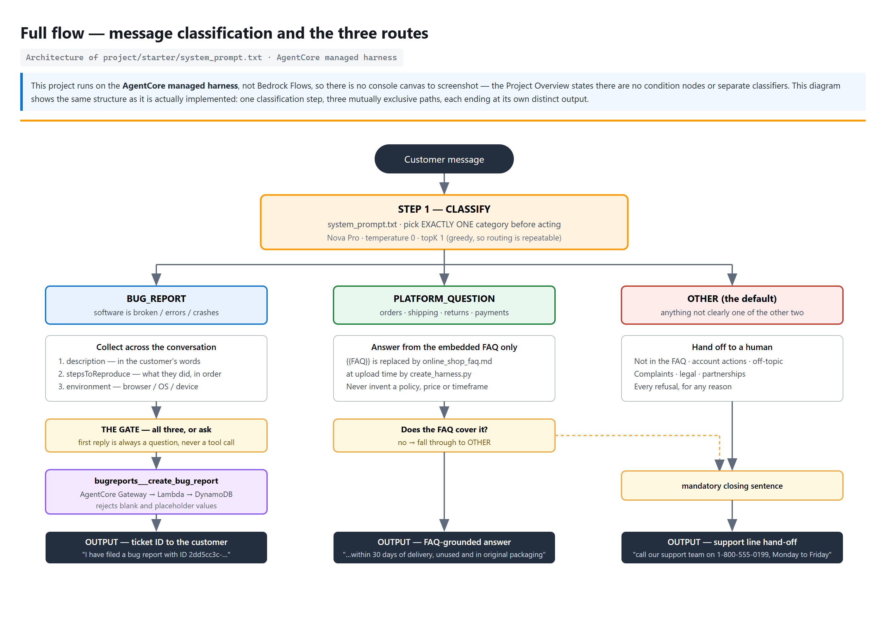
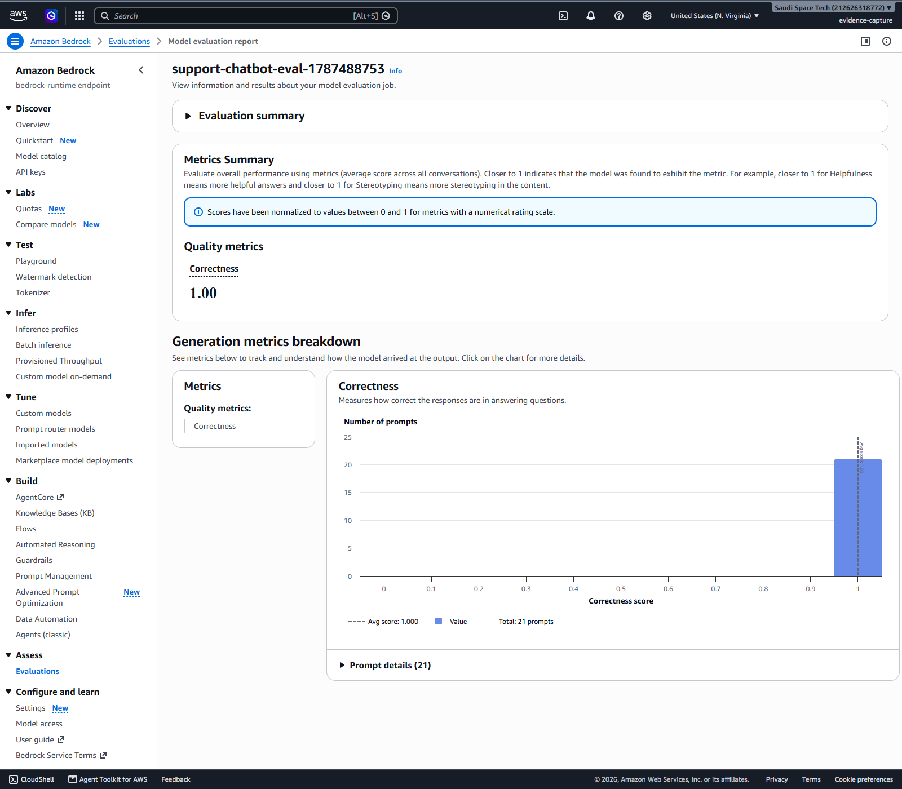
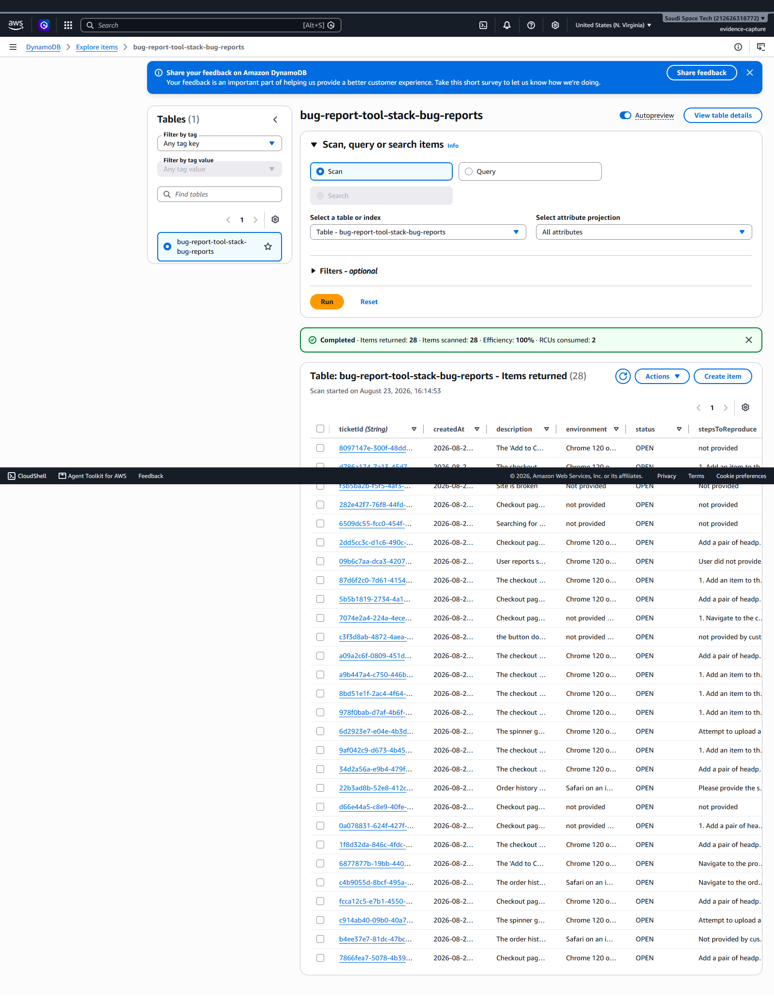

# Agentic AI — AWS Nanodegree, Project 1

**Customer Support Chatbot with Amazon Bedrock AgentCore**

A customer support chatbot for a fictional online shop, built on the Amazon
Bedrock **AgentCore managed harness**. Every incoming message is routed to one
of three behaviours — and all of the routing lives in a single system prompt,
not in condition nodes or a separate classifier.

| Route | Behaviour |
|---|---|
| **Bug report** | Collects the description, the steps to reproduce, and the customer's environment across the conversation, then files a ticket via the `create_bug_report` tool (Lambda → DynamoDB) and relays the ticket ID |
| **Platform question** | Answers from the embedded FAQ **only** — orders, shipping, returns, refunds, payments, products, accounts, privacy |
| **Anything else** | Politely hands off to the human support line, `1-800-555-0199` |

---

## Status

| | |
|---|---|
| Offline test suite | **169 tests, all passing** — `python -m pytest` |
| AWS deployment | ✅ deployed and verified end to end in `us-east-1` |
| Bug-report route | ✅ **`ALL 8 CHECKS PASSED`** (run 6) |
| FAQ + hand-off routes | ✅ **all 5 spot checks pass** |
| **Bedrock Evaluations** | ✅ **mean correctness 1.000** over 21 records (21× 1.0) |
| Guardrail | ✅ blocks injection and prompt extraction, no false positives |
| Evidence | [`evidence/run-01/`](evidence/run-01/) — needs screenshots |

### The run that mattered

Run 4 was the first clean measurement. Earlier runs averaged several jobs
together, because Bedrock wrote every job into one shared S3 prefix.

```
you> Your checkout page crashes every single time I click the Pay button.
bot> Could you please describe the exact steps you take that lead to the crash?

you> I add a pair of headphones to the cart, go to checkout... page goes white.
bot> Thanks for the details. On which device and browser does this happen?

you> I'm using Chrome 120 on macOS Sonoma, on a MacBook Air.
bot> [tool call] bugreports___create_bug_report
     I have filed a bug report with ID 34d2a56a-...
```

One question per turn, all three fields collected from the customer, exactly
one tool call, the real ticket ID relayed, and the DynamoDB item matching what
was said. That rubric row had failed in every previous run.

Getting there took four live runs and surfaced six real defects: a premature
tool call with fabricated fields, duplicate tickets, leaked `<thinking>` tags,
a hand-off that dropped the phone number, a guardrail that blocked genuine
customers, and a score silently averaged across every previous run. Each is
written up in [`docs/EVALUATION.md`](docs/EVALUATION.md) — what it was, why it
happened, and the fix.

---

**Grading each rubric line against the evidence:** [`SUBMISSION.md`](SUBMISSION.md).

---

## Evidence at a glance

Every rubric item with its artefact shown inline is in
**[`evidence/README.md`](evidence/README.md)**. The headline pieces:

### The full flow

One classification step, three mutually exclusive paths, each ending at its
own distinct output. This runs on the **AgentCore managed harness**, not
Bedrock Flows, so the routing lives in `system_prompt.txt` rather than on a
console canvas — the Project Overview says outright that there are no
condition nodes or separate classifiers.



### Bedrock Evaluations — correctness 1.00



### Tickets the chatbot filed



### The classifier, the routing rules, and the embedded FAQ

| | |
|---|---|
| [Classifier prompt](evidence/run-02/screenshots/07-classifier-prompt.png) | The `STEP 1 - CLASSIFY` block, verbatim |
| [Condition expressions](evidence/run-02/screenshots/08-condition-expressions.png) | The routing rules and near-miss pairs |
| [FAQ embedded in the prompt](evidence/run-02/screenshots/09-faq-embedded-in-prompt.png) | `{{FAQ}}` before and after substitution |
| [Route responses](evidence/run-02/screenshots/10-faq-and-handoff-responses.png) | Covered · uncovered · other-request |

---

## Run the whole thing on AWS in one command

Open **AWS CloudShell** in **us-east-1** and paste the single line from
[`cloudshell/PASTE-THIS.txt`](cloudshell/PASTE-THIS.txt).

That one line reconstructs the full runner from an embedded gzip payload and
executes it — no clone, no upload, no credentials to configure (CloudShell
already has them). It will:

1. Check Nova Pro access up front, so a missing model grant fails in seconds
   rather than five minutes into CloudFormation
2. Fetch the Udacity starter files and write the deliverables
3. Deploy the tool stack, then smoke-test the Lambda both ways — a valid
   ticket, and a blank-field payload that must be *rejected*
4. Create the gateway and the harness
5. Drive a **live three-turn bug report** and verify the stored DynamoDB item
   field-by-field against what the scripted customer actually said
6. Spot-check the FAQ, hand-off and injection routes
7. Deploy the testing stack, generate the 21-case dataset, and run a Bedrock
   Evaluations job, printing the mean correctness score
8. Print exactly which files to download and which screenshots to take

It is **resumable** — re-paste it if a CloudShell session drops and finished
steps are skipped. It **never deletes working resources**; teardown commands
are printed at the end for you to run once you have your evidence.

Prefer to read it first? [`cloudshell/run-all.sh`](cloudshell/run-all.sh) is
the same script, uncompressed — upload it with **Actions → Upload file** and
run `bash run-all.sh`. Details in [`cloudshell/README.md`](cloudshell/README.md).

## Capturing the console screenshots

The rubric asks for console screenshots. Rather than clicking through the
console by hand:

```powershell
.\scripts\capture-evidence.ps1
```

It drives a **real Chrome session against the real AWS console**, screenshots
the Bedrock Evaluations, DynamoDB, Lambda, CloudWatch and CloudFormation
pages, saves them into `evidence/run-NN/screenshots/`, uploads them to the
evaluation S3 bucket, and commits them.

The first run opens a browser window and waits for you to sign in. That
session is saved to a git-ignored profile, so every later run is fully
automatic. `-Federated -CreateUser` removes the manual sign-in entirely by
minting a console URL with `sts:GetFederationToken` — which needs an IAM
user, since root cannot call it.

One deliberate limitation: it screenshots the console, it does not render
console-lookalike pages from API data. A fabricated image presented as a
console screenshot is a falsified record, so the browser really does load
each page.

## Running it yourself

The project is deployed and verified in account `212626318772`, `us-east-1`.
To reproduce it in any account, use the one-command CloudShell runner above —
it needs nothing but Nova Pro model access enabled in the Bedrock console.

Locally, the offline suite runs with no AWS account at all:

```bash
python -m pytest      # 115 tests, ~4 seconds
```

The AWS CLI is not installed on the original development machine, which is
why the live run happens in CloudShell — it has the CLI, credentials and
Python already.

> **Note on credentials.** The run 1 preflight reported
> `arn:aws:iam::212626318772:root`. Root has no permission boundary and its
> access keys cannot be scoped or rotated per-service. Create an IAM user
> with the permissions this project needs and use that instead. See
> [`docs/SECURITY.md`](docs/SECURITY.md).

## Quick start

```bash
git clone <this repo>
cd agentic-ai-aws-nanodegree-project-1

python -m venv venv
source venv/bin/activate          # Windows: venv\Scripts\activate
pip install -r requirements.txt -r requirements-dev.txt

cp .env.example .env              # then fill in your AWS keys

python -m pytest                  # 130 offline tests, no AWS needed
```

Loading `.env` into your shell:

```bash
set -a && source .env && set +a                      # bash / git-bash
```
```powershell
Get-Content .env | ForEach-Object {                  # PowerShell
  if ($_ -match '^\s*([^#=]+)=(.*)$') {
    [Environment]::SetEnvironmentVariable($matches[1].Trim(), $matches[2].Trim(), 'Process') } }
```

## Deploying to AWS

Every command runs from `project/starter/`. The full walkthrough, with
troubleshooting, is in [`docs/RUNBOOK.md`](docs/RUNBOOK.md).

There is also a `Makefile` with shortcuts (`make test`, `make deploy-all`,
`make evaluate`, `make clean-aws`) — but **`make` is not installed on this
machine**, so the commands below are the ones to use. `make help` lists the
targets wherever `make` is available.

```bash
cd project/starter

# 1. Tool stack: DynamoDB table + Lambda + IAM roles
aws cloudformation deploy --template-file cloudformation-tool.yaml \
  --stack-name bug-report-tool-stack --capabilities CAPABILITY_NAMED_IAM \
  --region us-east-1

# 2. Gateway: exposes the Lambda as the create_bug_report tool
python setup_gateway.py            # writes agentcore_config.json

# 3. Harness: uploads system_prompt.txt with {{FAQ}} substituted
python create_harness.py           # first run ~2-3 minutes

# 4. Try it
python chat.py

# 5. Evaluate
aws cloudformation deploy --template-file cloudformation-testing.yaml \
  --stack-name bug-report-testing-stack --capabilities CAPABILITY_NAMED_IAM \
  --region us-east-1
python generate-eval-dataset.py --tests-json harness-tests.json
python run_evaluation.py --wait

# 6. Tear down
python cleanup_agentcore.py
```

Iterating on the prompt is just: edit `system_prompt.txt`, re-run
`create_harness.py`, start a fresh `chat.py`. Nothing is redeployed.

---

## What's in here

```
project/starter/               every command runs from this folder
  system_prompt.txt            ★ the main deliverable — all routing lives here
  harness-tests.json           ★ 21 evaluation cases across the three routes
  online_shop_faq.md             the shop's FAQ, extended with gift-card entries
  run_evaluation.py            ★ uploads the dataset and starts the eval job
  cloudformation-tool.yaml       DynamoDB + Lambda + 3 IAM roles
  cloudformation-testing.yaml    S3 bucket + Bedrock Evaluations role
  create_bug_report.py           the Lambda behind the tool
  setup_gateway.py               creates the gateway, registers the tool
  create_harness.py              creates/updates the harness from the prompt
  chat.py                        terminal client, one conversation per run
  generate-eval-dataset.py       runs the suite, writes the JSONL
  cleanup_agentcore.py           deletes harness, target, gateway

tests/                         ★ offline end-to-end suite (no AWS required)
  fake_agentcore.py              stand-in for the AgentCore runtime
  test_lambda_handler.py         the real Lambda, faked table
  test_system_prompt.py          structural checks on the deliverable
  test_harness_tests_suite.py    route coverage in the eval suite
  test_cloudformation.py         template structure and output names
  test_end_to_end_offline.py     full pipeline, multi-turn bug reports
  test_run_evaluation.py         the eval dataset pre-flight validator

docs/
  ARCHITECTURE.md                how the pieces fit, with a diagram
  RUNBOOK.md                     deploy, verify, iterate, tear down
  PROMPT_DESIGN.md               why the prompt is shaped the way it is
  EVALUATION.md                  the evaluation method + results template
  SECURITY.md                    credential handling and the rotation notice
```

★ = written for this project. Everything else is the Udacity starter,
unchanged, so the graded files stay byte-identical to what the course ships.

---

## What the tests do and do not prove

`python -m pytest` runs 83 tests with no AWS account and no network. The
pipeline they exercise is the real one everywhere it can be:

```
chat.py / generate-eval-dataset.py     ← real starter code
    └─ invoke_harness                  ← faked (tests/fake_agentcore.py)
        └─ tool call via gateway       ← faked
            └─ lambda_handler          ← REAL code from create_bug_report.py
                └─ DynamoDB put_item   ← faked in-memory table
    └─ streamed event parsing          ← real
    └─ output_eval_dataset.jsonl       ← real writer, schema asserted
```

**Proven offline:** the Lambda's validation and DynamoDB writes; that a blank
required field is rejected instead of filed; that tickets get unique IDs; that
the streaming parser finds tool calls and text; that a bug report is collected
across several turns and files exactly one ticket; that sessions stay isolated;
that the JSONL matches the Bedrock Evaluations BYOI schema; that the CFN
outputs `setup_gateway.py` reads by name actually exist; that the Lambda code
embedded in the template hasn't drifted from the standalone file.

**Not proven offline:** whether Nova Pro actually routes messages correctly.
The routing in the offline suite is done by a keyword matcher
(`ScriptedModel`) that mirrors the prompt's rules — it makes the tests
deterministic, but a green run means *"the wiring is correct"*, not *"the
model behaves"*. That question is what the Bedrock Evaluations run answers,
and [`docs/EVALUATION.md`](docs/EVALUATION.md) is where its results go.

---

## Design notes

The interesting decisions are written up in
[`docs/PROMPT_DESIGN.md`](docs/PROMPT_DESIGN.md). The short version:

- **Classify first, then act.** The prompt makes categorisation an explicit
  first step with crisp definitions, because vague categories produce vague
  routing.
- **Bug reports are sticky.** Once collection starts it continues until the
  ticket is filed, so a bare `"Chrome"` reads as an answer rather than a new
  request.
- **The near-miss cases are called out by name.** *"Why was my payment
  declined?"* is an FAQ question; *"the payment page shows a 500 error"* is a
  bug. Those two lines do more for routing accuracy than any amount of
  general instruction.
- **The FAQ is fenced as data.** Everything after `--- FAQ document ---` is
  labelled untrusted reference material, so an injection hidden in the FAQ
  cannot take over.
- **One question per message**, per the project tips — it measurably beats
  asking for all three fields at once.

---

## Cost and cleanup

DynamoDB is on-demand, the Lambda is free-tier-sized, and the gateway and
harness cost nothing at rest. The real spend is Nova Pro tokens: the whole
FAQ is re-sent on every turn (~7 KB), and a 21-case evaluation run is roughly
21 harness invocations plus 21 judge calls.

Tear everything down with `make clean-aws`, or follow Step 6 above. Empty the
S3 bucket **before** deleting the testing stack — CloudFormation cannot delete
a non-empty bucket and the stack ends up in `DELETE_FAILED`.
